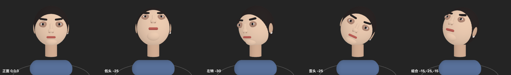

# AirPods Motion

在 macOS 上读取 AirPods 的头部姿态传感器：实时 3D 人头预览、四步引导式轴向校准、陀螺仪零偏测量。
纯 Swift + SwiftUI + SceneKit，无第三方依赖，数据只在内存中，不落盘、不联网。

> **EN** — A macOS app that reads AirPods head-tracking motion via `CMHeadphoneMotionManager`.
> Live 3D head-pose preview, a four-step guided axis calibration that *measures* the sign of each
> axis instead of hard-coding it, and a gyro-bias measurement that uses gravity-anchored
> pitch/roll as a built-in control group. Swift + SwiftUI + SceneKit, no dependencies.
> Frames stay in memory — nothing is written to disk or sent anywhere.



## 快速开始

```bash
./build.sh     # 构建
./test.sh      # 跑数学部分的单元测试
```

构建完从**访达双击** `AirPodsMotion.app`（原因见下方「用法」）。

## 踩过的坑:自己把数据流掐死

一个值得记下来的失败。为了处理「耳机离线后 CoreMotion 不自愈」，
加了个看门狗定时重启数据流，结果它自己变成了更严重的故障：

```
16:34:50.649  start: available=true
16:34:50.671  耳机已连接                      ← start 之后仅 22 毫秒
16:34:50.671  reconnect #1 available=true     ← 同一毫秒,流被拆了重建
   ... reconnect #2 … #44,全程 available=true ...
16:38:47.097  stop: 共 0 帧, 重连 44 次
```

`headphoneMotionManagerDidConnect` 在 `startDeviceMotionUpdates` 之后
22 毫秒就无条件调了重连，把刚建立的流拆掉。**只要这么撕一次，
CoreMotion 的耳机运动会话就再也起不来** —— 后面 44 次重连全部无效，
`isDeviceMotionAvailable` 始终是 `true`，回调不报任何错，一帧不来。

修法是给连接回调加去抖，而不是调宽限期：

```swift
if running, Date().timeIntervalSince(lastRestart) > 10 { reconnect() }
```

正常情况下**首帧约 1.9 秒到达**。所以看门狗的宽限期必须远大于这个值
（本项目取 20 秒），重试还要指数退避，否则就是在它吐出第一帧之前
反复掐死它。

另一个相关的坑:ad-hoc 签名每次重建 cdhash 都会变，TCC 里按代码签名
匹配的旧授权会对不上号，出现「数据库写着已授权、app 拿到 notDetermined」
的拧巴状态。`build.sh` 因此每次构建都会 `tccutil reset Motion`。

## 用法

**必须从访达双击 `AirPodsMotion.app` 启动。**

不能在终端里跑。原因：macOS 的 TCC 权限判定看的是「责任进程」
（responsible process）——顺着进程链往上找谁该为这次访问负责。
从终端/Claude Code 启动，责任进程会被算成终端，TCC 去查终端的
Info.plist，找不到 NSMotionUsageDescription 就直接 SIGABRT 杀掉，
连弹框都不给。从访达启动，launchd 是爹，app 自己就是责任进程。

首次点「开始」会弹「想要访问运动与健身数据」，同意即可。
授权后在 系统设置 › 隐私与安全性 › 运动与健身 里可随时撤销。

## 前提

- macOS 14+（CMHeadphoneMotionManager 在 macOS 上从 14.0 才有）
- 支持头部追踪的 AirPods 已连接（AirPods Pro / Max / 3代及以后）
- 若「耳机运动可用」显示「否」，多半是耳机没连或型号不支持

## 重新构建

    ./build.sh

## 校准引导（四步，每步都要手动确认）

点「引导校准」(⇧⌘K)。每一步分三个阶段，**程序不会自己往前跑**：

1. **准备** — 告诉你待会儿要做什么动作，看完点「开始这一步」
2. **执行** — 进度条实时反馈：幅度不够时是蓝色「幅度还不够，继续」，
   到位后变绿并提示「保持住…」，需要保持 0.8 秒
3. **确认** — 显示实测到多少度、方向已记录，点「下一步」才继续

四个步骤：

| 步骤 | 动作 | 作用 |
|---|---|---|
| 1 | 坐正看向屏幕正前方 | 3 秒倒计时，结束瞬间的朝向记为零点 |
| 2 | 慢慢低头看键盘 | 判定俯仰轴符号 |
| 3 | 慢慢把头转向左边 | 判定偏航轴符号 |
| 4 | 把头歪向右肩 | 判定侧倾轴符号 |

每步都可以「重做这一步」，后三步可以「跳过」，Esc 退出校准。

**为什么要做动作而不是写死符号**：CoreMotion 给头戴设备的姿态轴向
没有公开文档，不同型号/固件的正负方向可能不一致。让你做规定动作、
程序看数值往哪边跑，比猜可靠。结果（P/Y/R 三个符号）存在
UserDefaults 里，下次启动自动沿用。

「重设零点」(⌘K) 只重做第 1 步，换坐姿时用。
「清除」把零点和轴向一起清掉。

## 3D 头部模型

SceneKit 用基本几何体实时驱动，不依赖模型文件。见 head_preview.png。

两个踩过的坑记在这里：

- **材质一律用 lambert，不用 physicallyBased**。PBR + 多盏灯会在球面上
  糊一大片高光，正好盖住五官。五官靠颜色明度差读出来，不靠高光。
- **五官必须按颅骨表面坐标定位**（`onSkull(方位角, 仰角, 外移量)`），
  不能叠一个"脸盘"球体再往上摆——特征会被埋进球体内部，只剩边缘露出来。

脖子、肩膀、地面环是静止参照，只有头转。右耳有只白色 AirPod，
如果它出现在屏幕左边说明左右反了。模型有低通平滑（系数 0.35）。

## 数据说明

- pitch/roll/yaw：头部姿态，单位度
- 用户加速度：已扣除重力分量，单位 G
- 角速度：单位 rad/s

左右耳各自的 IMU 在耳机端已融合，Mac 收到的是一路合成姿态，
不是左右两路独立数据。

## 轴向约定（已用离屏渲染实测确认，见 axis_check.png）

SceneKit 右手系，相机在 +Z 看向 -Z，脸朝 +Z：

| 旋转 | 屏幕上的效果 | 对应动作（镜像视角） |
|---|---|---|
| `euler.x > 0` | 看见发顶，下巴收进去 | 低头 |
| `euler.y < 0` | 鼻子转向屏幕左 | 头转向左 |
| `euler.z < 0` | 头顶歪向屏幕右 | 歪向右肩 |

所以校准第 2 步（低头）要让 `euler.x` 为**正**，符号 = +sign(实测)；
第 3、4 步要让对应分量为**负**，符号 = -sign(实测)。

⚠️ 踩过的坑：绕 +X 正转时，脸的法向量 (0,0,1) 变成 (0,-sinθ,cosθ)，
y 分量变负 = 脸朝下。别凭直觉以为"头顶往后倒就是抬头"，会反。
改这类符号一律先离屏渲染看图，别推理。

## 退出崩溃（已修）

`startDeviceMotionUpdates(to: .main)` 不停就退出 → CoreMotion 仍在往
主队列投递回调，而对象已在析构 → EXC_BAD_ACCESS，崩溃栈 frame 0 在
CoreMotion 内部、由 NSBlockOperation 调起。

修法：MotionModel 改单例，接 NSApplicationDelegate 的
applicationWillTerminate 调 shutdown()（停采集 + 清 delegate），
deinit 里也兜一次。

## 陀螺仪零偏测量（⌘D）

⚠️ **必须戴着测，不能摘下来放桌上。**

AirPods 的皮肤检测一旦判定「不在耳朵里」，运动数据流会直接断掉 ——
摘下来静置这个做法根本行不通，什么也测不到。

### 为什么戴着测也算数：pitch/roll 是自带的对照组

俯仰和侧倾有重力锚定，**不会漂**。所以它们在测量期间的变化量，
就是「你的头实际动了多少」的量级。偏航没有任何绝对参考，只能靠
陀螺仪积分。于是：

- pitch/roll 几乎不动，yaw 却持续单向爬 → 那个爬升是陀螺仪零偏
- pitch/roll 和 yaw 一起乱动 → 是你的头在动，零偏被淹没了

程序按 `|yaw率| > 3 × max(|pitch率|,|roll率|)` 判定结果是否可信，
界面上直接标「结果可信 / 还不够静 / 结果不可信」。

### 实现要点

- 每 0.5 秒采一点，最小二乘拟合斜率，×60 得 °/min
- 角度先解缠绕（`unwrapDelta`），否则 yaw 越过 ±180 会算出巨大假斜率
- **断流看门狗**：2 秒没收到新帧就标红「数据流已中断」并说明原因。
  断流期间不计入 elapsed —— 否则 t 轴被拉长、斜率被稀释成假的小值
- 头 2 秒数据丢弃，等读数稳定后才设基准
- 晃动幅度 = pitch/roll 的峰峰值，超过 4° 直接判定结果不可信

### 测试

    ./test.sh

15 项合成数据测试（无噪/含噪斜率还原、点数不足保护、±180 跨越解缠绕、
yaw 多次绕圈后仍还原真实漂移率）。数学部分在 Sources/DriftMath.swift，
无任何依赖，可脱离 app 单独跑。

## 为什么 yaw 一定会漂（SDK 层面的证据）

    macOS 的 CMAttitudeReferenceFrame 只编译进两个值：
      XArbitraryZVertical / XArbitraryCorrectedZVertical
      （XMagneticNorth / XTrueNorth 只在注释里，不在枚举中）
    startDeviceMotionUpdatesUsingReferenceFrame:  API_UNAVAILABLE(macos)
    CMDeviceMotion.magneticField / .heading       iOS only
    CMHeadphoneMotionManager                      连参考系参数都不提供

两个可选参考系都叫 XArbitrary——Apple 在类型层面就说明了：
水平方向的零点是任意的。

## License

MIT，见 [LICENSE](LICENSE)。
